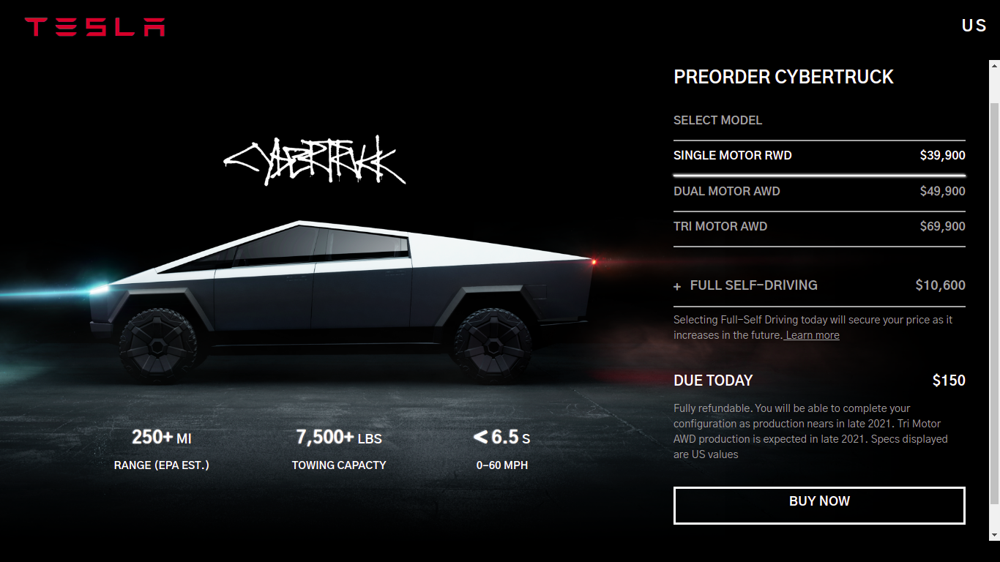
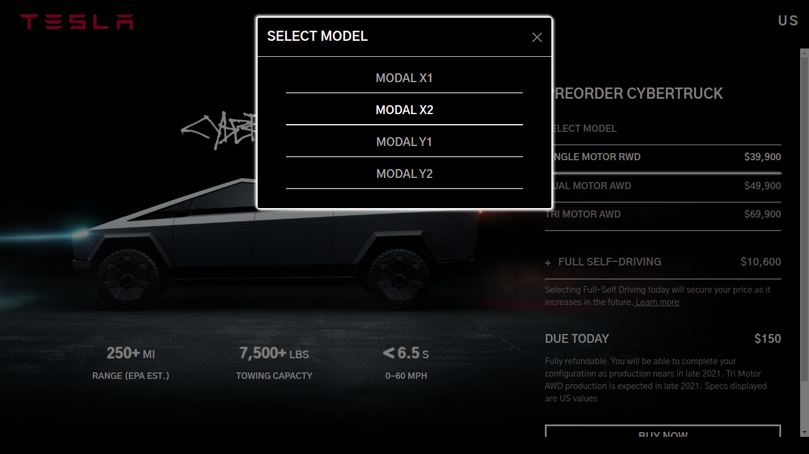
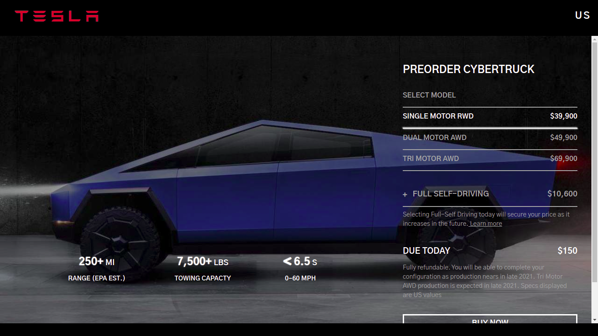
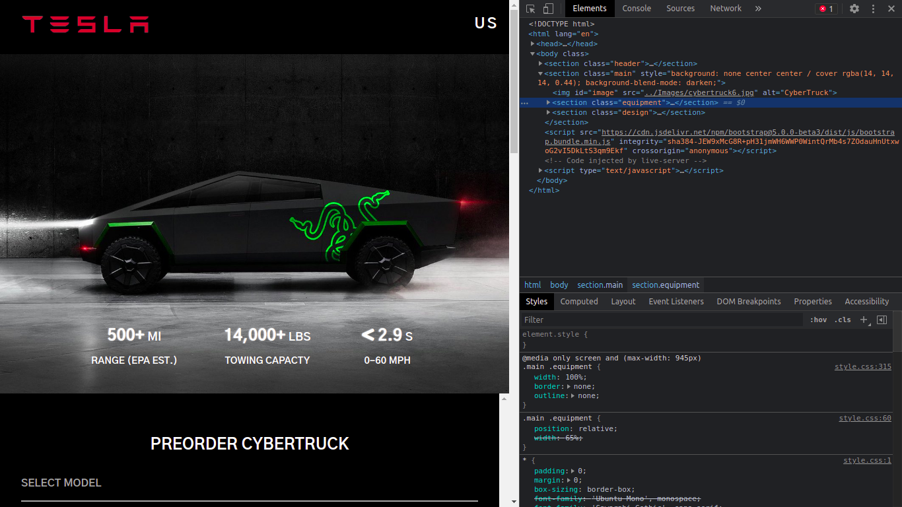

<h1 style="text-align:center">Tesla | Design Your CyberTuck</h1>
<h2> Description:-</h2>

 This site is a redesigned version of tesla's original site. This site is fully responsive i.e, adaptive to both destop and mobile-screen devices. It is built using <b>HTML</b>,<b>CSS</b>,<b>JQUERY</b> and little bit of <b>BOOTSTRAP</b> framework

<h2>Old Feature Used</h2>

Options to select motor, whether the car should be fully self driven or manual, and buy now option

<h2> New Feature added:-</h2>

An option to select model of the cybertruck is added. This option not only selects the model but also gives the image of the model selected to give better usser experience

<h2>Images:-</h2>
<figure>
  
  <figcaption >Home Page</figcaption>
</figure>
<figure>
  
  <figcaption >Model Selection</figcaption>
</figure>
<figure>
  
  <figcaption >Selected Model</figcaption>
</figure>
<figure>
  
  <figcaption >Overall inspection</figcaption>
</figure>